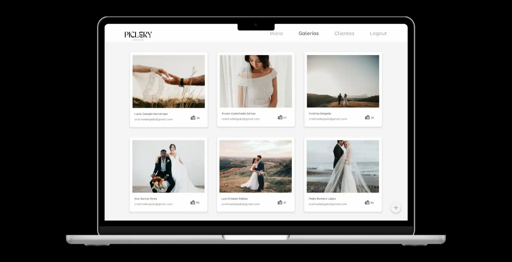

# Piclery

Piclery es una aplicación web desarrollada con Node.js, Express y React - estilos: Material UI -, perfecta para fotógrafos que quieren administrar sus clientes y galerías de fotos. La base de datos utilizada es MongoDB con Mongoose.

## Diseño

- Figma: [Piclery](https://www.figma.com/proto/tXBn8M6dpxvyywTgyq9Pte/MyappGallety?type=design&node-id=10-152&scaling=scale-down&page-id=0%3A1)

## Instalación

1. Clona este repositorio: `git clone https://github.com/FSDSTR1023/verde-frontend.git`
2. Navega a la carpeta `verde-frontend`
3. Instala las dependencias del cliente: `npm install`, `yarn install` o `pnpm i`

## Uso

1. Inicia el [servidor](https://github.com/FSDSTR1023/verde-backend.git) 👈 :  `npm start`, `yarn start` o `pnpm start` 
2. Inicia el cliente: `npm start`, `yarn start` o `pnpm start` (desde la carpeta `verde-frontend`)

## Contribución

Si deseas contribuir a este proyecto, sigue estos pasos:

1. Haz un *fork* del repositorio
2. Crea una rama para tu contribución: `git checkout -b feature/AmazingFeature`
3. Realiza tus cambios y haz *commit*: `git commit -m 'Add some AmazingFeature'`
4. Haz *push* a la rama: `git push origin feature/AmazingFeature`
5. Abre una solicitud de extracción

## Licencia

Distribuido bajo la licencia MIT. Ver `LICENSE` para más información.

## Contacto

Grupo verde - [appmygallery@gmail.com](mailto:appmygallery@gmail.com)

En caso de dudas o sugerencias, no dudes en contactarnos.
